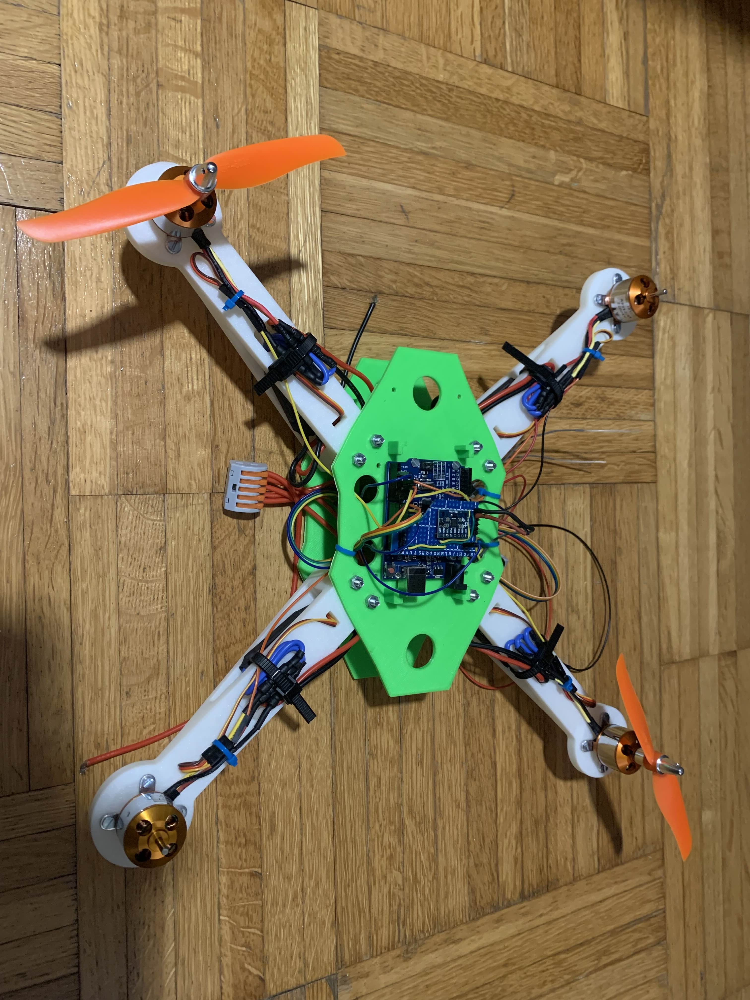

---

# Arduino Drone Project  

---

## 📖 Table of Contents  
1. [Disclaimer ⚠️](#disclaimer-️)  
2. [Overview](#overview)  
3. [Features](#features)  
4. [Hardware Components](#hardware-components)  
5. [Software Components](#software-components)  
6. [Setup Instructions](#setup-instructions)  
7. [Usage](#usage)  
8. [Improvements & Future Work](#improvements--future-work)  
9. [3D Printed Frame](#3d-printed-frame)  
10. [Images](#images)  
11. [License](#license)  

---

## Disclaimer ⚠️  
This project involves working with high-speed motors, LiPo batteries, and potentially dangerous components. Improper handling or assembly can result in injury, fire, or damage to property. **By using this project, you acknowledge that you do so at your own risk.** The creator assumes **no responsibility** for any harm or damage caused by building, programming, or operating this drone. **Always follow safety precautions and local regulations.**  

## Overview  
This project involves building a drone from scratch using Arduino, handling both the programming and assembly. The drone is designed for stability, maneuverability, and basic manual flight control.

## Features  
- **Custom Flight Controller**: Developed using Arduino.
- **Sensor Integration**: Uses an IMU (Inertial Measurement Unit) for stabilization.
- **Wireless Communication**: Remote control via an RF module.
- **Motor Control**: Manages brushless motors with an ESC (Electronic Speed Controller).
- **Battery Management**: Powered by a LiPo battery.

## Hardware Components

| Component           | Specification/Example          |  
|--------------------|--------------------------------|  
| **Microcontroller** | Arduino Uno|
| **Motors**         | Brushless DC motors (2204 2300KV) |
| **ESCs**           | 4x Electronic Speed Controllers (30A) |
| **Frame**          | [3D Printed Frame](#3d-printed-frame) |
| **Battery**        | LiPo 3S/4S with proper discharge rating |
| **IMU Sensor**     | MPU6050 |
| **Communication**  | FS-I6 radio transmitter / FS-IA6 receiver |
| **Propellers**     | Matched to motor KV rating |

## 🖨️ **3D Printed Frame**  
The drone frame is **3D printed** for lightweight durability and easy customization.  

### 📂 **Download STL Files**  
You can download the necessary STL files for printing the frame from:  
👉 [Frame STL Files](https://cults3d.com/en/3d-model/gadget/apm-2-8-drone-frame)

### 🏗️ **Recommended Print Settings**  
- **Material**: ABS
- **Infill**: 30%-50% for strength

---

## Software Components  
- **Flight Controller Code**: Written in Arduino C++  
- **PID Controller**: Implemented for stabilization
- **Failsafe Mechanisms**: Emergency landing and low battery detection (not implemented)

## Setup Instructions  
1. **Assemble the Frame**: Attach motors, ESCs, and mount the Arduino.
2. **Wire Components**: Connect ESCs to the motors and the Arduino flight controller.
3. **Upload the Code**: Upload the provided flight controller program to the Arduino.
4. **Calibrate Sensors**: Ensure the MPU5060 offset values are correct
5. **Test the Drone**: Start with a tethered test before full flight.

## Usage  
- **Power On**: Connect the battery and ensure all components are functional.
- **Remote Control**: Use an RC transmitter for control.
- **Emergency Protocols**: Activate emergency landing if signal is lost. (not implemented)

## Improvements & Future Work
- Emergency landing
- Implement GPS for autonomous navigation.  
- Add a camera for FPV (First Person View) flight.  
- Enhance flight algorithms for better stability.  

---

